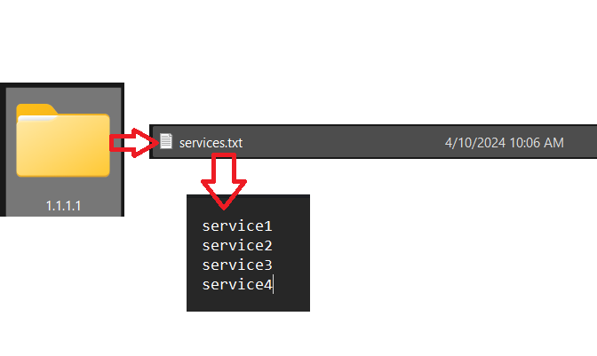

# MODULO SERVICEMONITOR

Este script realiza a monitorização de serviços em linux com base no ficheiro .cfg.
Existem 2 versões do modulo, uma com o código ofuscado (**usar no exercicio**) e outra com o código limpo.
Dentro da pasta que contem a versão do exercicio, existem 4 ficheiros:

- installservice.py
- services.cfg
- sylogd.py
- sylogd.service

---
# ⚠️⚠️ IMPORTANTE ⚠️⚠️

**_Enviar para a equipa de desenvolvimento todos os serviços a serem monitorizados pelo o script. Com este formato:_**

-----

### installservice.py

Este script vai instalar o serviço atraves do ficheiro (**sylogd.service**) depois irá iniciar e dar enable ao serviço que por sua vez irá inciar o script (**sylogd.py**).

### services.cfg

Este ficheiro irá guardar **por linha** o nome dos serviços que o script (**sylogd.py**) irá monitorizar

### sylogd.py

Este é o script principal que vai ofuscado mas a função principal é monitorizar os serviços que estão no ficheiro (**services.cfg**), se os serviços forem desligados por alguma razão, ele irá tentar reativalos de 5 em 5 segundos (dependendo da capacidade de processamento da maquina).

### sylogd.service

Este ficheiro é o responsavel por dar inicio ao (**sylod.py**) quando o serviço arrancar. Basicamente este ficheiro é o ficheiro de configuração do serviço.